## はじめに
キー操作系ファイラ―のFD、FILMTN、WinFMっぽいSFTP/SCP対応のタブ型ファイラ―です。  
初めは、自分で使う用に作成したのですが、某掲示板できいたところ使いたいという方がおられましたので公開しました。  
その後、SCP(SSH)対応を試作したところ、思いのほか便利だったので機能追加を行っています。
 
- 任意のフォルダをドライブとして登録し、数字キーを使って移動することが出来ます。  
  （NW共有フォルダ、SFTP、SCPもドライブとして登録出来ます）
- Windowsを使う人や、Windowsを踏み台にしてLinuxを使う人に便利だと思います。
- SCP(SSH)においてもマクロなどを含めて、ほぼすべてのキーコマンドがWindowsと同様に利用できます。
- 動作環境は、Windows10 .NET Framework 4.6.1以上となります。
- 対応しているメディア(音声・動画)形式は利用している.netのコントロールに依存します。  
  （おそらくWindows MediaPlayerに依存します）
- 対応している画像形式は利用しているDLL（Imagemagick）に依存します。  
  ※GhostScriptが必要なPDF等の形式には対応してません。

## インストール・設定
- レジストリは使用してません。任意のディレクトリに解凍して下さい。
- アンインストールはディレクトリごと削除して下さい。
- confディレクトリに設定情報が保存されます。
- 別ディレクトリに解凍し、色設定を変えることで、Windows用/Linux接続用のような使い分けもできると思います  
  （複数起動は可能ですが、設定ファイルは１つのため、別設定にする場合はディレクトリを分けてください）
- ドライブ設定ファイル「Yz-Drives.json」がない状態で起動すると、PCに接続されて  
  いる論理ドライブ(A:&yen;～Z:&yen;)を自動的にスキャンして登録します。  
  （デフォルト設定の00番は、ホームディレクトリになります）  
  ドライブの設定情報は、F7キーで変更できます。  
- F7キーのドライブ設定画面では、Insertキー/右クリックで設定追加、Delキーで削除となります。  
  尚、数字キーで該当するドライブへの移動となります。  

  設定画面を開いた後、「Get」ボタンを押すとカレントディレクトリの情報が表示されます。  
  （カレントディレクトリは、事前にHキーコマンドで移動しておくことが出来ます）  
  
    - Mode指定は、WIN：ローカル、SMB：NW共有フォルダ、SFTP：SFTP、SCP：SCP接続です。

    - SMBのRoot Directory指定は、「&yen;フォルダ名1&yen;フォルダ名2…」です。  
     フォルダ名1は必ず指定して下さい。
  
    - SFTP/SCPのRoot Directory指定は、「/」です。  
     フォルダ名を指定する場合、「/フォルダ名1/フォルダ名2…」  
     のように指定してください。
   
- テキストエディタの指定などの初期設定は、F8キーで設定できます。  
  設定項目は以下の通りです。
  
    - Toolタブ
  
      - テキストエディタの指定

      - Gキー（文字列検索時）のテキストエディタへの行・列指定オプション  
        ※未確認ですが、ヘルプを読む限り以下のように指定すれば良いと思います。  
        （%Row%, %Col%が行・列番号に置換されます）  

        | エディタ | 設定例 |
        --- | --- 
        sakura | -X=%Col% -Y=%Row%
        秀丸 | /j%Row%,%Col%
        TeraPad | /jl=%Row%

      - テキストビューアで読み込む最大容量  
        処理時間がかかる（文字コード判定）ため、容量を制限してます。  
        変更時は、MB単位のため注意して下さい。
     
      - SFTP/SCPでのバイナリビューアで読み込む最大容量  
        転送時間がかかるため、容量を制限してます。  
        変更時は、MB単位のため注意して下さい。

      - 改行文字（CR/LF/CRLF）
        テキストビューアで表示される改行文字です。  
        複数文字も設定可能です。
        
      - SFTP/SCPでファイル編集時にバックアップファイルを作成するかどうかの設定  
        テキストエディタや拡張子の関連付けで開いて更新した場合、「ファイル名_bkup」ファイルを作成するかどうかの設定

    - Extensionタブ

      - テキスト/テキストから除外/画像/メディア/Zipの拡張子（大文字小文字問わず、カンマ区切りで指定） 

        | 拡張子 | 説明 |
        --- | --- 
        テキスト | Gキー（文字列検索時）の対象テキストファイル拡張子  
        テキストから除外 | Gキー（文字列検索時）の対象外テキストファイル拡張子  
        画像 | 画像ビューアの表示対象画像ファイル拡張子  
        メディア | メディアビューアの表示対象音声・動画ファイル拡張子  
        Zip | Zipビューアの表示対象ファイル拡張子  

    - SSHタブ  
      設定画面下部に記載されている項目にパラメータが置換されます  
      サンプルを参考にして、設定して下さい

      - サンプル  
        Open SSHとPuTTYの設定サンプルを表示します

      - タイムアウト  
        SFTP/SCPドライブ接続時のタイムアウト時間（秒）を設定します

      - SSHクライアント  
        SSHクライアントのフルパスを設定します

      - SSHクライアント引数  
        SSHクライアントで自動ログインするための引数を設定します  
        マクロファイル名（%MACRO_FILE%）は、内部でフルパスが設定されます

      - SSHクライアントログインマクロ  
        マクロファイル（%MACRO_FILE%）に出力されるマクロです  
        「ログイン」「カレントフォルダへの移動」「追加コマンド（%SSH_ADD_MACRO%）」を設定して下さい  
        追加コマンド（%SSH_ADD_MACRO%）は、以降の2つの項目のどちらかが自動的に選択されます

      - 追加コマンド（%SSH_ADD_MACRO%）-wait-  
        実行後、キー入力待ちをするように設定して下さい  
        「"」が入れ子になる場合は、Open SSHのサンプルを参考にしてください

      - 追加コマンド（%SSH_ADD_MACRO%）-login-  
        実行後、ログインするように設定して下さい  
        「"」が入れ子になる場合は、Open SSHのサンプルを参考にしてください

    - ZIPタブ  
      設定画面下部に記載されている項目にパラメータが置換されます
    
      - ZIPビューアの指定  
        Enterで起動されるZIPビューアのフルパスを指定します
        
      - ZIPビューアの引数  
        ZIPファイルのパスは自動的に末尾に追加されます

      - ZIP圧縮ソフトの指定  
        Pキーコマンドで起動されるZIP圧縮ソフトのフルパスを指定します

      - ZIP圧縮ソフトの引数-no password-  
        パスワード指定なしの場合の引数を設定します。  
        （7zipの例「a "%ZIP_FILE%" @"%COMPRESS_LIST_FILE%"」）  
        圧縮ファイルリストのファイル名（%COMPRESS_LIST_FILE%）は、内部でフルパスが設定されます

      - ZIP圧縮ソフトの引数-with password-  
        パスワード指定ありの場合の引数を設定します。  
        （7zipの例「a -p%PASS% "%ZIP_FILE%" @"%COMPRESS_LIST_FILE%"」）  
        圧縮ファイルリストのファイル名（%COMPRESS_LIST_FILE%）は、内部でフルパスが設定されます

      - ZIP解凍ソフトの指定  
        Uキーコマンドで起動されるZIP解凍ソフトのフルパスを指定します

      - ZIP解凍ソフトの引数-no password-  
        パスワード指定なしの場合の引数を設定します。  
        パスワードが必要なファイルの場合、異常終了するように設定して下さい  
        （7zipの例「x -aoa -p"" "%ZIP_FILE%"」）

      - ZIP解凍ソフトの引数-with password-  
        パスワード指定ありの場合の引数を設定します。  
        （7zipの例「x -aoa -p%PASS% "%ZIP_FILE%"」）

    - Colorタブ  
      変更結果が随時表示されるので、サンプルを参考に変更してください  
      ESCキーかCancelボタンで取り消せます  
      自分で設定した色は次回起動時にも反映されますがバックアップされません（1世代のみ保持）  
      複数パターン保存したい場合は、confフォルダ配下に「Yz-Colors.json」ファイルが保存されてるので自分で退避して下さい
    
      - サンプル  
        カラーサンプルを表示します

      | White | Dark | Dark Navy | Dark Brown | Dark Green |
      :----: | :----: | :----: | :----: | :----:
      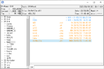 | 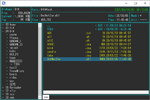 | 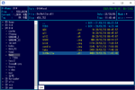 | 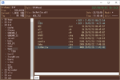 | 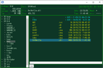

  - キーコマンド一覧は、F1キーで表示されます。  
    [こちらにも一覧があります](./KeyCommand.md)

## 環境・制限・いいわけ
- ゴミ箱には対応してません。削除したらゴミ箱に移動せず削除となります。

- 画像ビューアの画像効果は、「Fred's ImageMagick Scripts」などを参考にしてます。  
  せっかくImagemagickのDLLを利用してるので、追加で作成してみました。  
  処理速度は遅いです。また、それっぽく見えないかもしれません。  
  画像サイズが限定されているのは、処理速度の問題と、サイズが大きい画像は  
  それっぽく見えないことが理由です。

  | 元画像 | グレースケール | スケッチ風 |
  :----: | :----: | :----:
   |  | 

  | 水彩画風 | 漫画風(3値化) | 黒板アート風 |
  :----: | :----: | :----:
   | 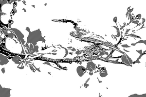 | 

- SFTPはKOReaderとのファイルのやりとりを目的にして作りました。  
  他の環境では、うまく動作しないかもしれません。
- SFTP/SCPのキーファイルはOpenSSH形式です。
- SFTP/SCPのドライブ登録時にパスワードを空欄で登録することも可能です。  
  その場合、パスワード認証時に毎回パスワード入力が求められます。

- SSHサーバー側で必要な環境
  - ログインユーザーの/tmpへの読み書き権限
  - 以下のコマンド  
    cat, cd, chmod, df, echo, find, grep, id, mkdir, mv, pwd,  
    read, readlink, rm, rmdir, split, touch, unzip, zip

- NW監視は実施してません。
- NW共有フォルダやSFTP/SCPとの通信が切断された場合の動作は保証しません。  
  ※表示されている情報がおかしい場合は、ドライブ移動して下さい。
- ローカルドライブやNW共有フォルダへの接続に失敗した場合、パスワード入力  
  を求められますが、認証失敗が原因ではない場合、パスワードを入力しても  
  接続できません。

- SFTP/SCPのクリップボードへのファイル一覧格納は、独自形式です。  
  そのため、SFTP/SCPは他のアプリケーションとのCopy/Paste、D&Dの互換性はありません。
- SFTP/SCPのファイル/ディレクトリ更新監視は実施してません。  
  F5キーを押して更新して下さい
- SFTP/SCPへのファイル書き込み/読み出しの最大サイズは2GBまでです。

- Shift + テンキーはOS(？)により別の機能が割り当てられているため、ドライブ移動が実行されません。
- TreeViewダブルクリックは、閉じる時にはディレクトリ移動せず、開くときに移動します。  
  ダブルクリックしても反応がない場合は、もう一度ダブルクリックして開いて下さい。
- ファイルコピー時など、パーミッションがないディレクトリは勝手にスキップします。  
  パーミッションがないファイルの場合は、0byteファイルとしてコピーされます。

- 大量のファイルをコピーするとランサムウェア誤検出されます（全てのファイラーが同様だと思います）  
  ウィルスチェックは実施済みです

- 起動後にドライブレターが増えた（USBドライブが追加された）場合、新タブで開きます  
  追加されたドライブの全タブを閉じた場合、USBイジェクト処理を行います

- ListViewに表示されてるファイル情報の横幅は変更できません（Bindingすると固まるため）

- SCPシンボリックリンクへの対応は不完全であり、また、ハードリンクには対応してません

- 実行ファイルコピー後、ウィルス検知ソフトが掴んでしまう事があり、タイムスタンプや  
  属性の反映に失敗してしまう事があります

## ライブラリ類およびライセンス
- 本ソフトウェア（Yz-Filer）  
  Copyright (c) 2020 Yz  
  Released under the MIT license  
  https://opensource.org/licenses/mit-license.php  
  作者または著作権者は、本ソフトウェアに起因して被った直接的または間接的損害については一切責任を負わず、また保証/補償も出来ません

- hnx8さんのHnx8.ReadJEnc（テキストファイル文字エンコード自動判別）  
  MIT License  
  https://github.com/hnx8/ReadJEnc/blob/master/LICENSE

- Xceed Extended WPF Toolkit  
  コミュニティライセンス契約（非商用目的）に準じます。  
  Xceedの著作権表示と非商用を求められています。  
  https://github.com/xceedsoftware/wpftoolkit/blob/master/license.md

- Magick.NET  
  Apacheライセンス バージョン2.0  
  https://github.com/dlemstra/Magick.NET/blob/master/License.txt

- SSH.NET  
  MIT License  
  https://github.com/sshnet/SSH.NET/blob/master/LICENSE
  
- WTFManager  
  LGPL

- Microsoft System.Text.Json  
  MIT License  
  https://www.nuget.org/packages/System.Text.Json/

- Microsoft.Bcl.AsyncInterfaces  
  MIT License  
  https://www.nuget.org/packages/Microsoft.Bcl.AsyncInterfaces/

- AvalonEdit  
  MIT License  
  https://opensource.org/licenses/MIT

- Be.HexEditor  
  MIT License  
  https://github.com/Pkcs11Admin/Be.HexEditor/blob/master/LICENSE.txt

## おわりに
C#プログラムについては、DOBONさん始め多くの方のHPを参考にさせて頂きました。  
また、hnx8さんやその他の方のライブラリも使わせてもらいました。  
類似品の公開をご快諾頂いたWinFM作者様もありがとうございました。  

## おまけ1
画像効果がちょっと面白かったので、遊んでみました

| スケッチ風 | 水彩画風 |
:----: | :----:
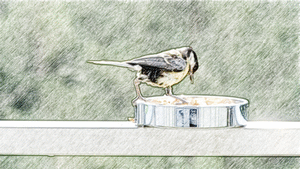 | 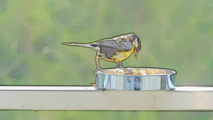

| 漫画風(3値化) | 黒板アート風 |
:----: | :----:
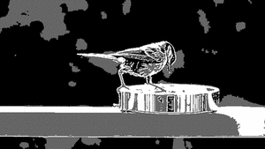 | 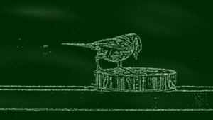

- 環境  
  コマンドライン版の以下のツールが必要です  
  - ffmpeg
  - ImageMagick

- ffmpegで動画から静止画を抽出  
  ```ffmpeg -i video.mp4 -ss 0 -t 2 -r 4 -q:v 1 -f image2 %03d.jpg```

  | オプション | 説明 |
  --- | ---
  video.mp4 | 対象とする動画パス
  ss | 開始時間(sec)
  t | 切り出し時間(sec)
  r | 1秒間の間で切り出す枚数(4を指定すると0.25秒毎に1枚出力)
  q:v | 品質指定（「1」で最高品質）
  %03d.jpg | 出力ファイル名(%03dは3桁の通番)

- 抽出した静止画に対して画像ビューアのEffectを使って手動で画像効果を適用

- ImageMagickで一括リサイズ（任意）  
  ※指定した全ての画像が変換されるので注意  
  ```mogrify.exe -resize 400x400 *.png```

  | オプション | 説明 |
  --- | ---
  400x400 | 幅x高さ（アスペクト比維持）
  \*.png | 対象ファイル指定

- アニメーションGIFを作成する場合は、ImageMagickでアニメーションGIF作成  
  ```convert.exe -delay 25 -loop 0 *.png out.gif```

  | オプション | 説明 |
  --- | ---
  delay | 画像の切り替え時間(1/100秒単位。25を指定すると0.25秒毎に切り替え)
  loop | 繰り返し回数(0を指定すると無限)
  \*.png | 対象ファイル指定
  out.gif | 出力ファイル名

- 動画を作成する場合は、ffmpegで動画作成  
  ```ffmpeg -framerate 4 -i %03d.png -vcodec libx264 -pix_fmt yuv420p -r 4 -b:v 2000k out.mp4```

  | オプション | 説明 |
  --- | ---
  framerate | 入力フレームレート
  %03d.png | 対象ファイル指定(1から始まる3桁の通番)
  libx264 | 動画コーデック指定
  r | 出力フレームレート
  b:v | 動画のビットレート
  out.mp4 | 出力ファイル名
  
## おまけ2(画像まとめて変換)
おまけ1の手動部分が面倒くさかったので、やっつけで「画像まとめて変換」君を作ってみました。  
ついでに、背景画像も指定出来るようにしてみました。  
※対応している入出力画像は、「\*.jpg」のみです。  
※背景画像は同梱してません。  
※Effectの設定は、画像ビューアとは異なる物もあるため、処理結果が同じになるとは限りません

| スケッチパッド(2値化) | Tシャツ(2値化) |
:----: | :----:
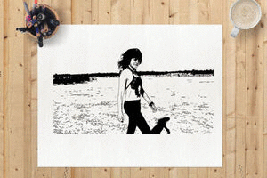 | 

| 板(2値化) | 黒板アート風 |
:----: | :----:
 | 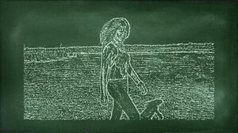

「画像まとめて変換」君のインストール
- レジストリは使用してません。任意のディレクトリに解凍して下さい。
- アンインストールはディレクトリごと削除して下さい。

やり方は、おまけ1とほとんど同じです。
- ffmpegで連番画像を出力(FPSの調整とかは、ここで実施)
- 「画像まとめて変換」君起動後の設定画面で、入出力ディレクトリ、処理モード、背景画像などを選択し「OK」
- 経過画面が表示されるので、「Start」で変換開始
- 出力ディレクトリにjpg画像が出力されているので、おまけ1の手順でアニメーションGIFか動画を作成  
  ※拡張子がjpgになってるので、おまけ1の「.png」は「.jpg」に修正して下さい

## おまけ3(動画変換)
OpenCVを使って高速化しました。  
以下のURLで公開してます。  
https://github.com/Yz-Filer/Yz-VideoEffect
