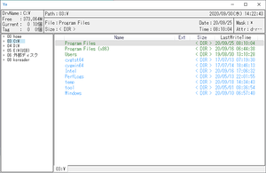
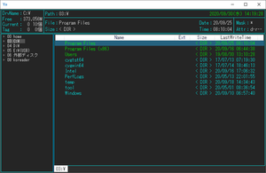
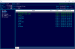

## はじめに
キー操作系ファイラ―のFD、FILMTN、WinFMっぽいタブ型ファイラ―です。  
任意のフォルダをドライブとして登録し、数字キーを使って移動することが出来ます。  
（NW共有フォルダ、ZIPファイル、SFTPもドライブとして登録出来ます）
- 動作環境は、Windows10 .NET Framework 4.6.1以上となります。
- 対応している圧縮形式はZIPのみです。  
（読み込み可能なZIPファイルは利用しているDLL(Ionic Zip)に依存します）
- 対応しているメディア(音声・動画)形式は利用している.netのコントロールに依存します。  
（おそらくWindows MediaPlayerに依存します）
- 対応している画像形式は利用しているDLL（Imagemagick）に依存します。  
※GhostScriptが必要なPDF等の形式には対応してません。
- ファイルリストの複数行表示（段組み？）には対応してません。

## インストール・設定
- レジストリは使用してません。任意のディレクトリに解凍して下さい。
- アンインストールはディレクトリごと削除して下さい。
- confディレクトリに設定情報が保存されます。
- 色の設定ファイルは、「Yz-Colors.json」となります。  
  設定ファイルがない場合は、デフォルト色設定になります。  
  サンプル「Yz-Colors_Dark.json」「Yz-Colors_DarkNavy.json」がconfディレクトリ内に  
  解凍されていますので、「Yz-Colors.json」にリネームして使ってください。  
  サンプルにはコメントもつけてるので、好みの色に設定することも可能だと思います。  
  （色の並びはARGBです。MainWindowの背景色は透明にはなりません）  

  | 標準色 | サンプル色(Dark) | サンプル色(DarkNavy) |
  :----: | :----: | :----:
   |  | 

- ドライブ設定ファイル「Yz-Drives.json」がない状態で起動すると、PCに接続されて  
  いる論理ドライブ(A:\～Z:\)を自動的にスキャンして登録します。  
  （デフォルト設定の00番は、ホームディレクトリになります）  
  ドライブの設定情報は、F7キーで変更できます。  
- F7キーの一覧画面では、Insertキー/右クリックで設定追加、Delキーで削除となります。  
  尚、数字キーで該当するドライブへの移動となります。  

  設定画面を開いた後、「Get」ボタンを押すとカレントディレクトリの情報が表示されます。  
  （カレントディレクトリは、事前にHキーコマンドで移動しておくことが出来ます）  
  
    - Mode指定は、WIN：ローカル、SMB：NW共有フォルダ、ZIP：ZIPファイル、SFTP：SFTP接続です。

    - SMBのRoot Directory指定は、「\\IPアドレス\フォルダ名1\フォルダ名2…」です。  
     フォルダ名1は必ず指定して下さい。
  
    - ZIPのRoot Directory指定は、「/フォルダ名1/フォルダ名2…」のように指定して下さい。  
     ZIP内のルートを指定する場合は、「/」を指定して下さい。  
     尚、ZIPファイルは必ず指定して下さい。

    - SFTPのRoot Directory指定は、「//IPアドレス:ポート番号」です。  
     フォルダ名を指定する場合、「//IPアドレス:ポート番号/フォルダ名1/フォルダ名2…」  
     のように指定してください。
   
- テキストエディタの指定などの初期設定は、F8キーで設定できます。  
  設定項目は以下の通りです。
  
    - テキストエディタの指定

    - Gキー（文字列検索時）のテキストエディタへの行・列指定オプション  
     ※未確認ですが、ヘルプを読む限り以下のように指定すれば良いと思います。  
      （%Row%, %Col%が行・列番号に置換されます）  

      | エディタ | 設定例 |
      --- | --- 
      sakura | -X=%Col% -Y=%Row%
      秀丸 | /j%Row%,%Col%
      TeraPad | /jl=%Row%

    - テキストビューアで読み込む最大容量  
     処理速度がかかる（文字コード判定/TABキーによるバイナリ表示）ため、容量を制限してます。  
     変更時は、KB単位のため注意して下さい。

    - テキスト/画像/メディアの拡張子（大文字小文字問わず、カンマ区切りで指定） 

      | 拡張子 | 説明 |
      --- | --- 
      テキスト | Gキー（文字列検索時）の対象テキストファイル拡張子  
      画像 | 画像ビューアの表示対象画像ファイル拡張子  
      メディア | メディアビューアの表示対象音声・動画ファイル拡張子  

    - ZIPドライブでテキストビューア/画像ビューアを利用するかどうかのフラグ  
     ランサムウェア誤検出対策として、デフォルトではOFF

- キーコマンド一覧は、F1キーで表示されます。

## 環境・制限・いいわけ
- .NET Framework/WPFを利用しています。技術力の問題もあり処理速度改善や標準コントロールに  
  依存するUIの改善は見込めません。

- ゴミ箱には対応してません。削除したらゴミ箱に移動せず削除となります。

- 画像ビューアの画像効果は、「Fred's ImageMagick Scripts」などを参考にしてます。  
  せっかくImagemagickのDLLを利用してるので、画像効果で少し遊んでみました。  
  処理速度は遅いです。また、それっぽく見えないかもしれません。  
  画像サイズが限定されているのは、処理速度の問題と、サイズが大きい画像は  
  それっぽく見えないことが理由です。

- SFTPはKOReaderとのファイルのやりとりを目的にして作りました。  
  他の環境では、うまく動作しないかもしれません。
- SFTPのキーファイルはOpenSSH形式です。
- SFTPのドライブ登録時にパスワードを空欄で登録することも可能です。  
  その場合、パスワード認証時に毎回パスワード入力が求められます。

- NW監視、媒体監視は実施してません。
- NW共有フォルダやSFTPとの通信が切断された場合の動作は保証しません。  
  ※表示されている情報がおかしい場合は、ドライブ移動して下さい。
- 外部媒体が取り外された場合の動作は保証しません。  
  ※表示されている情報がおかしい場合は、ドライブ移動して下さい。
- ローカルドライブやNW共有フォルダへの接続に失敗した場合、パスワード入力  
  を求められますが、認証失敗が原因ではない場合、パスワードを入力しても  
  接続できません。

- ZIP/SFTPのファイル属性や日付は、当てにならない/設定されてない/取れない物があるので  
  参考程度と考えて下さい（ZIP/SFTPとのコピー時に属性が外れた場合でも仕様となります）
- ZIP/SFTPのクリップボードへのファイル一覧格納は、独自形式です。  
  そのため、ZIP/SFTPは他のアプリケーションとのCopy/Paste、D&Dの互換性はありません。
- ZIP/SFTPのファイルコピー/移動進捗表示は利用しているDLLの制限によりファイル単位です。
- ZIP/SFTPのディレクトリ更新監視は実施してません。F5を押して更新して下さい
- ZIP/SFTPへのファイル書き込み/読み出しの最大サイズは2GBまでです。

- ZIPファイルのパスワードはZIPファイル内のファイル個別設定になります。  
  （一括圧縮時は全てのファイルに同じパスワードを設定していることになります）  
  追加時に別のパスワードを設定した場合は、一括解凍出来なくなりますので気を付けてください。  
  また、テキストビューア/画像ビューアなどでは同一ドライブ内の前のパスワードを保持してますので、  
  パスワードが原因で表示できなくなった場合は、一度別のドライブに移動して再接続して下さい。
- ZIPファイルの更新は、ファイルの追加・削除ではなくZIPファイル自体の作り変えになります。  
  そのため頻繁な更新は、都度作り変え待ちが発生するため効率が悪いです。
- ZIPファイルに頻繁にアクセスすると、ウィルス対策ソフトがランサムウェア誤検出をする場合があります。
- ランサムウェア誤検出対策に、起動オプションでZIPの画像ビューア/テキストビューアをOFFにしてます。  
  それでも、頻繁にファイルを追加したり削除したりした場合は、誤検出されてしまいます。  
  ※起動オプションはF8で変更できます。

- Shift + テンキーはOS(？)により別の機能が割り当てられているため、ドライブ移動が実行されません。
- TreeViewダブルクリックは、閉じる時にはディレクトリ移動せず、開くときに移動します。  
  ダブルクリックしても反応がない場合は、もう一度ダブルクリックして開いて下さい。
- ZIPで大文字/小文字が違う同名ファイル/ディレクトリ（例、「ABC.txt」「abc.txt」）を扱うと  
  同じファイル扱いになったり、別のファイル扱いになったりと動作が不定となります。  
  利用しているDLL側の問題じゃないかと思ってるのですが情報が見つかってません。
- ファイルコピー時など、パーミッションがないディレクトリは勝手にスキップします。  
  パーミッションがないファイルの場合は、0byteファイルとしてコピーされます。
  
## ライブラリ類およびライセンス
- 本ソフトウェア（Yz-Filer.net）  
  Copyright (c) 2020 Yz  
  Released under the MIT license  
  https://opensource.org/licenses/mit-license.php

- hnx8さんのHnx8.ReadJEnc（テキストファイル文字エンコード自動判別）  
  MIT License  
  https://github.com/hnx8/ReadJEnc/blob/master/LICENSE

- DotNetZip(Ionic Zip)  
  Microsoft Public License (Ms-PL)  
  著作権表示等はそのまま掲載する必要があるようなのでリンクを貼っておきます。  
  https://raw.githubusercontent.com/haf/DotNetZip.Semverd/master/LICENSE
  
- Xceed Extended WPF Toolkit  
  コミュニティライセンス契約（非商用目的）に準じます。  
  Xceedの著作権表示と非商用を求められています。  
  https://github.com/xceedsoftware/wpftoolkit/blob/master/license.md

- Magick.NET  
  Apacheライセンス バージョン2.0  
  https://github.com/dlemstra/Magick.NET/blob/master/License.txt

- SSH.NET  
  MIT License  
  https://github.com/sshnet/SSH.NET/blob/master/LICENSE
  
- WTFManager  
  LGPL

- Microsoft System.Text.Json  
  MIT License  
  https://www.nuget.org/packages/System.Text.Json/

- Microsoft.Bcl.AsyncInterfaces  
  MIT License  
  https://www.nuget.org/packages/Microsoft.Bcl.AsyncInterfaces/

## 最後に
はじめてC#でプログラムしました。  
ググリながら増改築を繰り返したので、びっくりするくらい行き当たりばったりなソースとなり、  
不具合が残ってるかもしれません。  

「.Net CoreならLinuxでも動くんじゃない？」と考えて論理ドライブ(A:\～Z:\)をやめたのですが、  
LinuxではWPFが動かないことを後から知り、「.NET Framework」に変更しました。  

なお、C#プログラムについては、DOBONさん始め多くの方のHPを参考にさせて頂きました。  
また、hnx8さんやその他の方のライブラリも使わせてもらいました。  
ありがとうございます。  

## おまけ
画像効果がちょっと面白かったので、遊んでみました

- 環境  
  コマンドライン版の以下のツールが必要です
  - ffmpeg
  - ImageMagick

- ffmpegで動画から静止画を抽出  
  ffmpeg -i video.mp4 -ss 0 -t 2 -r 4 -q:v 1 -f image2 %03d.jpg

  | オプション | 説明 |
  --- | ---
  video.mp4 | 対象とする動画パス
  ss | 開始時間(sec)
  t | 切り出し時間(sec)
  r | 1秒間の間で切り出す枚数(4を指定すると0.25秒毎に1枚出力)
  q:v | 品質指定（「1」で最高品質）
  %03d.jpg | 出力ファイル名(%03dは3桁の通番)

- 抽出した静止画に対して手動で画像効果を適用

- ImageMagickで一括リサイズ（任意）  
  ※指定した全ての画像が変換されるので注意  
  mogrify.exe -resize 400x400 *.png

  | オプション | 説明 |
  --- | ---
  400x400 | 幅x高さ（アスペクト比維持）
  *.png | 対象ファイル指定

- ImageMagickでアニメーションGIF作成  
  convert.exe -delay 25 -loop 0 \*.png movie.gif

  | オプション | 説明 |
  --- | ---
  delay | 画像の切り替え時間(1/100秒単位。25を指定すると0.25秒毎に切り替え)
  loop | 繰り返し回数(0を指定すると無限)
  *.png | 対象ファイル指定
  movie.gif | 出力ファイル名

- 動画にする場合は、ffmpegで作成  
  ffmpeg -framerate 4 -i %03d.jpg -vcodec libx264 -pix_fmt yuv420p -r 4 -b:v 4000k 00_out.mp4

  | オプション | 説明 |
  --- | ---
  framerate | 入力フレームレート
  r | 出力フレームレート
  b:v | 動画のビットレート
