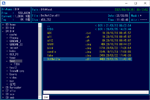
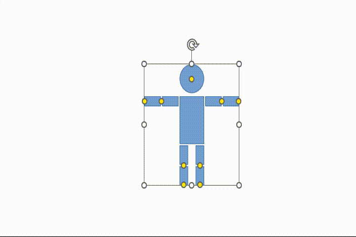

# [YzのRepositories](https://github.com/Yz-Filer)  

> [!NOTE]  
> `https://yz-filer.github.io/Yz-Filer/`のURLが表示されていて表示が崩れてる場合は、上記リンクからオリジナルページ`https://github.com/Yz-Filer`にアクセスして下さい。  

## 1. [Yz-Filer Ver.2](https://github.com/Yz-Filer/Yz-Filer/blob/master/Yz-Filer.md)  

  

キー操作系ファイラ―のFD、FILMTN、WinFMっぽいSFTP/SCP対応のタブ型ファイラ―です。  
※Windows版  

## 2. [Yz-Filer Ver.3（vectorに公開）](https://www.vector.co.jp/soft/data/util/se523591.html)  

キー操作系ファイラ―のFD、FILMTN、WinFMっぽいSFTP/SCP対応のタブ型ファイラ―です。  
※Go言語 + GTK3で作成したLinux対応版  

## 3. [go言語 & gotk3をちょっとやり直してみたい](https://github.com/Yz-Filer/golang)  

  

Yz-Filer作成時に調べきれなかった事とかがあったので、GeminiとWEB検索を利用して調べ直したメモです。  

- 他のPCで動作させる方法、テーマを使う方法  
- タスクトレイ常駐、いくつかのコントロール、カスタムシグナル、書式設定、クリップボード、USBドライブイジェクト、ディレクトリ監視、Drag and Drop、文字コード判定  
- 付箋アプリ、簡易メモ帳アプリ、画像ビューアアプリ  

などを記載してます。  

## 4. [Yz-VideoEffect / Yz-ImageEffect](https://github.com/Yz-Filer/Yz-VideoEffect)  

   

写真や動画をエッジ、2値化、3値化、水彩画風、黒板アート風、スケッチ風、アニメ風に変換するツールです。  

## 5. [OfficeShapeTool](https://github.com/Yz-Filer/OfficeShapeTool)  

  

Microsoft OfficeのPowerPoint形式（Office Open XMLのプレゼンテーション形式）で保存された図形に接続ポイントと調整ハンドルを追加するツールです。  
「図形の結合」機能とあわせて使うとオリジナルの図形が作成できます。  

