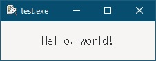

# [YzのRepositories](https://github.com/Yz-Filer)  

> [!NOTE]  
> `https://yz-filer.github.io/Yz-Filer/`のURLが表示されていて表示が崩れてる場合は、上記リンクからオリジナルページ`https://github.com/Yz-Filer`にアクセスして下さい。  

## 1. [Yz-Filer Ver.2](https://github.com/Yz-Filer/Yz-Filer/blob/master/Yz-Filer.md)  

  

キー操作系ファイラーのFD、FILMTN、WinFMっぽいSFTP/SCP対応のタブ型ファイラーです。  
C#言語で作成したWindows対応版となります。  

## 2. Yz-Filer Ver.3  

キー操作系ファイラーのFD、FILMTN、WinFMっぽいSMB/SCP対応のタブ型ファイラーです。  
Go言語 + GTK3で作成したLinux対応版となります。  

> [!NOTE]  
> Windows版も同梱してますが、gtk3の制約でDrag & Dropが出来ないなどの機能制限があります。  

[ここ](bin/Yz-Filer_3.0.zip)
に置いてます。 

## 3. [Yz-Filer Ver.3.1（vectorに公開）](https://www.vector.co.jp/soft/data/util/se523591.html)  

キー操作系ファイラーのFD、FILMTN、WinFMっぽいSMB/SCP対応のタブ型ファイラーです。  
Go言語 + GTK3で作成したLinux/Windows対応版となります。  
[go言語 & gotk3をちょっとやり直してみたい](https://github.com/Yz-Filer/golang)  で確認した内容を取り込んで、Windows版もDrag & Dropに対応しました。

   

gtk3を使ってるため、Ver.3から上図のように、テーマをカスタマイズすることで、半透明や背景画像の指定も出来るようになりました。  

> [!NOTE]
> 詳細は、[3. テーマを使いたい](https://github.com/Yz-Filer/golang/tree/main/Contents/03)を参照

Ver.3からVer.3.1への主な変更点は以下の通りです。

- Window環境でファイルエクスプローラーとのDnDおよびクリップボード経由でのファイルのコピー&ペーストに対応しました。
（DnDは「Shiftキー + Drop」でMove、「Ctrlキー + Drop」でCopyとなります）

- Windows環境でローカルファイルの右クリックメニューにエクスプローラーの右クリックメニューを表示するように変更しました。（一部表示されないサブメニューがあります）

- 機能には関係ないですが、リソースを埋め込んだのでgladeファイルが不要になりました。

- 機能的には大きく変わってませんが、画像ビューア、文字コード変換、USBディスク監視、ディレクトリ監視を「[go言語 & gotk3をちょっとやり直してみたい](https://github.com/Yz-Filer/golang)」の内容に変更しました。
（画像ビューアは、範囲指定、コピー(Ctrl + C)、ペースト(Ctrl + V)、背景色の変更に対応しました）  
  

- USBディスクを使用不可にしている端末では起動出来なかったため、USBディスク監視をOFFにするコマンドラインオプションを追加しました。起動時に「--no-usb-watcher」を引数に指定すると、ドライブスキャンおよびUSBディスク監視が行われなくなります。
（「C:\」などが初期表示されないため、必要に応じて「F7キーコマンド」で登録して下さい）

## 4. [go言語 & gotk3をちょっとやり直してみたい](https://github.com/Yz-Filer/golang)  

  

Yz-Filer作成時に調べきれなかった事とかがあったので、GeminiとWEB検索を利用して調べ直したメモです。  

- 他のPCで動作させる方法、テーマを使う方法  
- タスクトレイ常駐、いくつかのコントロール、カスタムシグナル、書式設定、クリップボード、USBドライブイジェクト、ディレクトリ監視、Drag and Drop、文字コード判定  
- 付箋アプリ、簡易メモ帳アプリ、画像ビューアアプリ  

などを記載してます。  

## 5. [Yz-VideoEffect / Yz-ImageEffect](https://github.com/Yz-Filer/Yz-VideoEffect)  

   

写真や動画をエッジ、2値化、3値化、水彩画風、黒板アート風、スケッチ風、アニメ風に変換するツールです。  

## 6. [OfficeShapeTool](https://github.com/Yz-Filer/OfficeShapeTool)  

  

Microsoft OfficeのPowerPoint形式（Office Open XMLのプレゼンテーション形式）で保存された図形に接続ポイントと調整ハンドルを追加するツールです。  
「図形の結合」機能とあわせて使うとオリジナルの図形が作成できます。  

